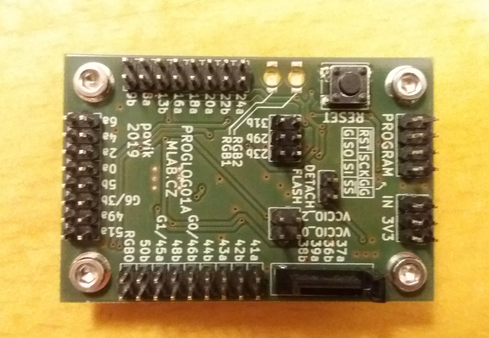
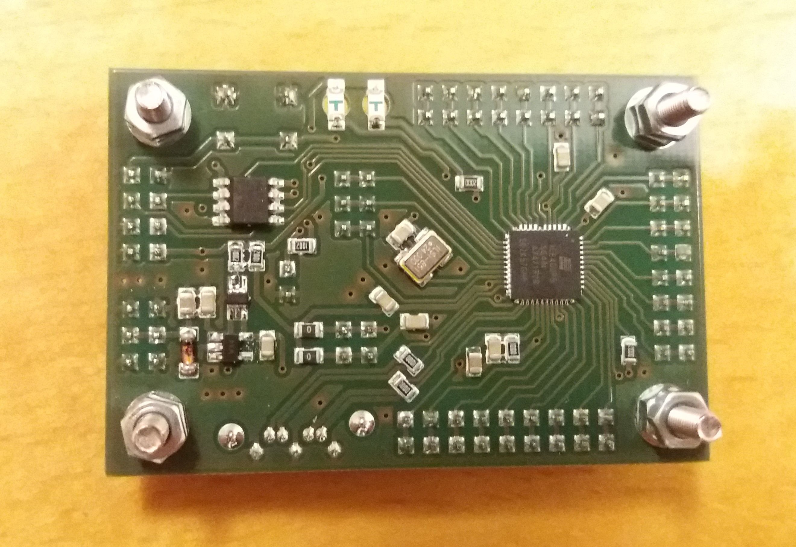

<!--- PrjInfo ---> <!--- Please remove this line after manually editing --->
<!--- 00a56be08b96043df9e37d6aff7b6990 --->
<!--- Created:2019-12-01 00:30:56.960578: --->
<!--- Author:: --->
<!--- AuthorEmail:: --->
<!--- Tags:: --->
<!--- Ust:: --->
<!--- Label --->
<!--- ELabel --->
<!--- Name:PROGLOG01A: --->
# PROGLOG01A
<!--- LongName --->
## PROGLOG01A module
<!--- ELongName --->

<!--- Lead --->
Module with a small programmable gate-array
<!--- ELead --->

<!--- Description --->
The FPGA module compatible with fully open source toolchains like [symbiflow](https://symbiflow.github.io/).
<!--- EDescription --->
<!--- Content --->
<!--- EContent --->
 Generated with [MLABweb](https://github.com/MLAB-project/MLABweb). (2019-12-01)
