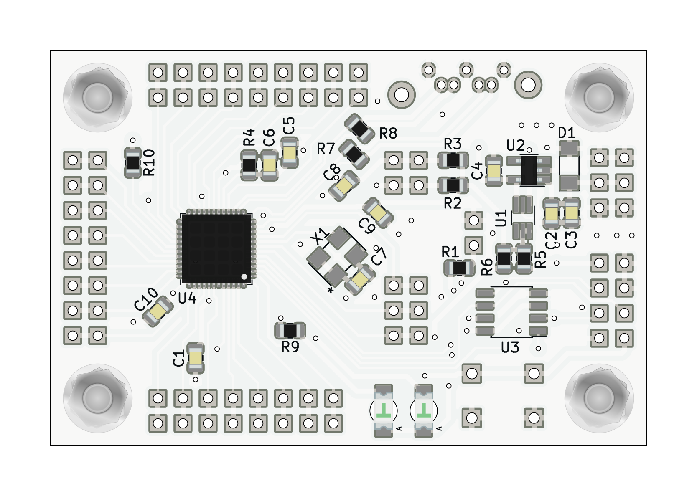

# PROGLOG01B - Small low-power open-source tool chain compatible FPGA

<!--- Lead --->
Module with a small programmable gate-array
<!--- ELead --->

The FPGA module compatible with fully open source toolchains like [symbiflow](https://symbiflow.github.io/).
